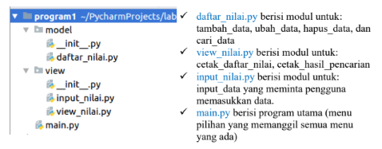
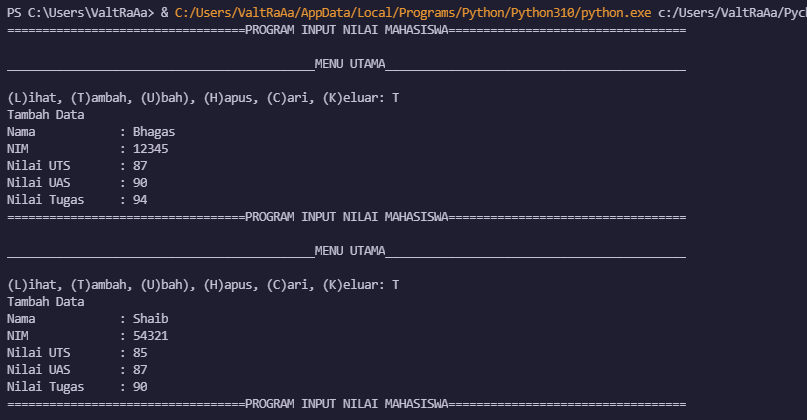
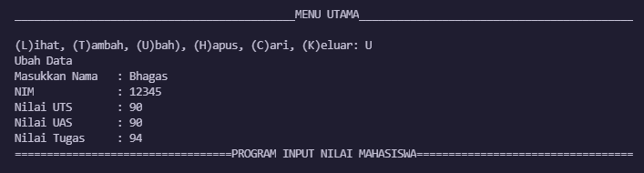
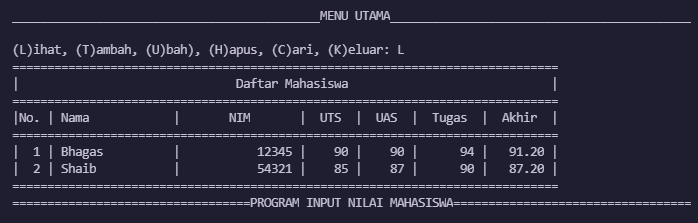
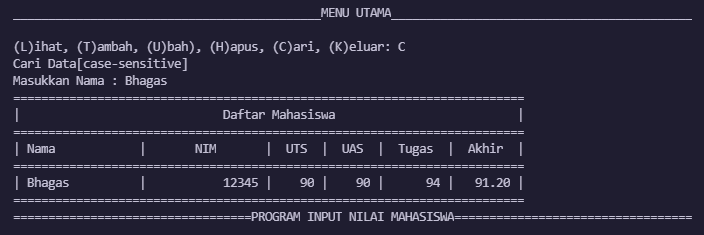
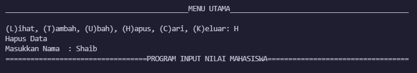

# Program1
### UAS Bahasa Pemrograman
```py
Nama  : Bhagas Shaib Pramono
NIM   : 312110506
Kelas : TI.21.A.1
```
> ### Soal :
Buatlah *package* dan modul dengan struktur sebagai berikut:



Kemudian buatlah file `README.md` yang berisi penjelasan dan *screenshot* hasil eksekusi program. Lalu upload ke *repository* github masing-masing.


## Penjelasan :

- Pada direktori model terdapat program `daftar_nilai.py` yang berisi modul untuk tambah_data, ubah_data, hapus_data, dan cari_data, dan pada direktori view terdapat 2 program yaitu `input_nilai.py` dan `view_nilai.py` yang berisikan modul untuk input_data yang meminta pengguna memasukan data dan berisi modul untuk cetak_daftar_nilai dan cetak_hasil_pencarian. Terakhir program `main.py` yang berisi program utama (menu pilihan yang memanggil semua menu yang ada). keempat program tersebut akan berhubungan menggunakan `from ... import *` kode program itu berfungsi agar kita dapat memanggil file lain di dalam satu module yang berbeda.

### daftar_nilai.py

```python
from model.daftar_nilai import *

data = {}

while True:
    header="PROGRAM INPUT NILAI MAHASISWA"
    header2=("MENU UTAMA")
    print(header.center(97,"="))
    print()
    print(header2.center(97,"_"))
    c = input("\n(L)ihat, (T)ambah, (U)bah), (H)apus, (C)ari, (K)eluar: ")

    if c.lower() == 't':
        print("Tambah Data")
        nama = input("Nama\t\t: ")
        nim = int(input("NIM\t\t: "))
        uts = int(input("Nilai UTS\t: "))
        uas = int(input("Nilai UAS\t: "))
        tugas = int(input("Nilai Tugas\t: "))
        akhir = tugas*30/100 + uts*35/100 + uas*35/100
        data[nama] = nim, uts, uas, tugas, akhir

    elif c.lower() == 'u':
        print("Ubah Data")
        nama = input("Masukkan Nama   : ")
        if nama in data.keys():
            nim = int(input("NIM\t\t: "))
            uts = int(input("Nilai UTS\t: "))
            uas = int(input("Nilai UAS\t: "))
            tugas = int(input("Nilai Tugas\t: "))
            akhir = tugas*30/100 + uts*35/100 + uas*35/100
            data[nama] = nim, uts, uas, tugas, akhir
        else:
            print("Nama {0} tidak ditemukan".format(nama))

    elif c.lower() == 'h':
        print("Hapus Data")
        nama = input("Masukkan Nama  : ")
        if nama in data.keys():
            del data[nama]
        else:
            print("Nama {0} Tidak Ditemukan".format(nama))

    elif c.lower() == 'c':
        print("Cari Data[case-sensitive]")
        nama = input("Masukkan Nama : ")
        if nama in data.keys():
            print("="*73)
            print("|                             Daftar Mahasiswa                          |")
            print("="*73)
            print("| Nama            |       NIM       |  UTS  |  UAS  |  Tugas  |  Akhir  |")
            print("="*73)
            print("| {0:15s} | {1:15d} | {2:5d} | {3:5d} | {4:7d} | {5:7.2f} |"
                  .format(nama, nim, uts, uas, tugas, akhir))
            print("="*73)
        else:
            print("Nama {0} Tidak Ditemukan".format(nama))

    elif c.lower() == 'l':
        if data.items():
            print("="*78)
            print("|                               Daftar Mahasiswa                             |")
            print("="*78)
            print("|No. | Nama            |       NIM       |  UTS  |  UAS  |  Tugas  |  Akhir  |")
            print("="*78)
            i = 0
            for z in data.items():
                i += 1
                print("| {no:2d} | {0:15s} | {1:15d} | {2:5d} | {3:5d} | {4:7d} | {5:7.2f} |"
                      .format(z[0][:13], z[1][0], z[1][1], z[1][2], z[1][3], z[1][4], no=i))
            print("=" * 78)
        else:
            print("="*78)
            print("|                               Daftar Mahasiswa                             |")
            print("="*78)
            print("|No. | Nama            |       NIM       |  UTS  |  UAS  |  Tugas  |  Akhir  |")
            print("="*78)
            print("|                                TIDAK ADA DATA                              |")
            print("="*78)

    elif c. lower() == 'k':
        break

    else:
        print("Pilih menu yang tersedia")
```

### input_nilai.py

```python
# Menginput data
def input_nama():
    print("\nMasukkan data mahasiswa")
    print("...")
    global nama
    nama = input("\nNama: ")
    return nama


def input_nim():
    global nim
    nim = input("NIM: ")
    return nim


def input_ntugas():
    global nilai_tugas
    nilai_tugas = int(input("Masukkan nilai tugas: "))
    return nilai_tugas


def input_nuts():
    global nilai_uts
    nilai_uts = int(input("Masukkan nilai UTS: "))
    return nilai_uts


def input_nuas():
    global nilai_uas
    nilai_uas = int(input("Masukkan nilai UAS: "))
    return nilai_uas


# Nilai akhir
def nakhir():
    global nilai_akhir
    nilai_akhir = (nilai_tugas)*30/100 + (nilai_uts)*35/100 + (nilai_uas)*35/100
    return nilai_akhir
```

### view_nilai.py

```python
# Menampilkan data
from model.daftar_nilai import data

def lihat_data():
    print("Daftar Nilai:")
    print("===================================================================")
    print("| No |      Nama      |    NIM    | Tugas |  UTS  |  UAS  | Akhir |")
    print("===================================================================")
    if data.keys():
        no = 1
        for tabel in data.values():
            print("| {0:2} | {1:14} | {2:9} | {3:5} | {4:5} | {5:5} | {6:5} |".format
                (no, tabel[0], tabel[1], tabel[2], tabel[3], tabel[4], tabel[5]))
            print('-------------------------------------------------------------------')
            no += 1
    else:
        print("=========================TIDAK ADA DATA============================")
        print("===================================================================")
```

### main.py

```python
from model.daftar_nilai import *
from view.view_nilai import *

# Mulai
print("===============================================================")
print("|                           Program 1                         |")
print("===============================================================")

while True:
    print("\n")
    menu = input("(L) Lihat, (T) Tambah, (H) Hapus, (U) Ubah, (C) Cari, (K) Keluar\nPilih menu: ")
    print("\n")

    # menu
    if menu.lower() == 't':
        tambah_data()

    elif menu.lower() == 'c':
        cari_data()

    elif menu.lower() == 'l':
        lihat_data()

    elif menu.lower() == 'u':
        ubah_data()

    elif menu.lower() == 'h':
        hapus_data()

    # Keluar
    elif menu.lower() == 'k':
        break

    else:
        print("Ada yang salah, silahkan cek kembali.")
```

## OUTPUT

- Tambah Data



- Ubah Data



- Lihat Data



- Cari Data



- Hapus Data 



## Terima Kasih